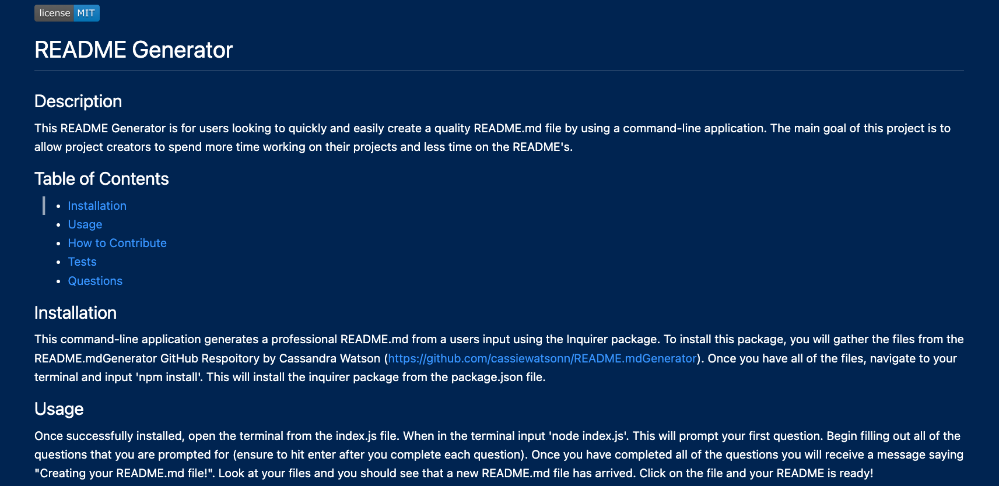
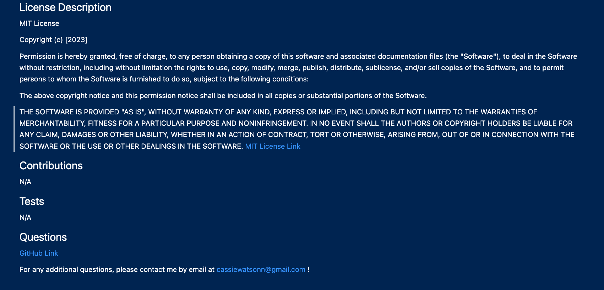

# README.mdGenerator

## Description

This README Generator is for users looking to quickly and easily create a quality README.md file by using a command-line application. The main goal of this project is to allow project creators to spend more time working on their projects and less time on the README's.  

As an aspriring web developer I want to be able to spend less time working on README's so I can spend more time on projects so I can build on my knowledge to further my studies.

## Installation 

This command-line application generates a professional README.md from a users input using the [Inquirer package](https://www.npmjs.com/package/inquirer/v/8.2.4). To install this package, you will gather the files from the README.mdGenerator GitHub Respoitory by Cassandra Watson (https://github.com/cassiewatsonn/README.mdGenerator). Once you have all of the files, navigate to your terminal and input 'npm install'. This will install the inquirer package from the package.json file. 

## Usage

Once successfully installed, open the terminal from the index.js file. When in the terminal input 'node index.js'. This will prompt your first question. Begin filling out all of the questions that you are prompted for (ensure to hit enter after you complete each question). Once you have completed all of the questions you will receive a message saying "Creating your README.md file!". Look at your files and you should see that a new README.md file has arrived. Click on the file and your README is ready! 

## 

## Link

https://github.com/cassiewatsonn/README.mdGenerator 

## Video Link

https://drive.google.com/file/d/1Ga10zyoWDSp54f_XdS19OsVCnPYGDY0v/view 

## Credits 

Thank you to my tutor Eric Sayer and my study partner Rebecca Lawrence! 

## License

MIT License

Copyright (c) [2023]

Permission is hereby granted, free of charge, to any person obtaining a copy
of this software and associated documentation files (the "Software"), to deal
in the Software without restriction, including without limitation the rights
to use, copy, modify, merge, publish, distribute, sublicense, and/or sell
copies of the Software, and to permit persons to whom the Software is
furnished to do so, subject to the following conditions:

The above copyright notice and this permission notice shall be included in all
copies or substantial portions of the Software.

THE SOFTWARE IS PROVIDED "AS IS", WITHOUT WARRANTY OF ANY KIND, EXPRESS OR
IMPLIED, INCLUDING BUT NOT LIMITED TO THE WARRANTIES OF MERCHANTABILITY,
FITNESS FOR A PARTICULAR PURPOSE AND NONINFRINGEMENT. IN NO EVENT SHALL THE
AUTHORS OR COPYRIGHT HOLDERS BE LIABLE FOR ANY CLAIM, DAMAGES OR OTHER
LIABILITY, WHETHER IN AN ACTION OF CONTRACT, TORT OR OTHERWISE, ARISING FROM,
OUT OF OR IN CONNECTION WITH THE SOFTWARE OR THE USE OR OTHER DEALINGS IN THE
SOFTWARE.